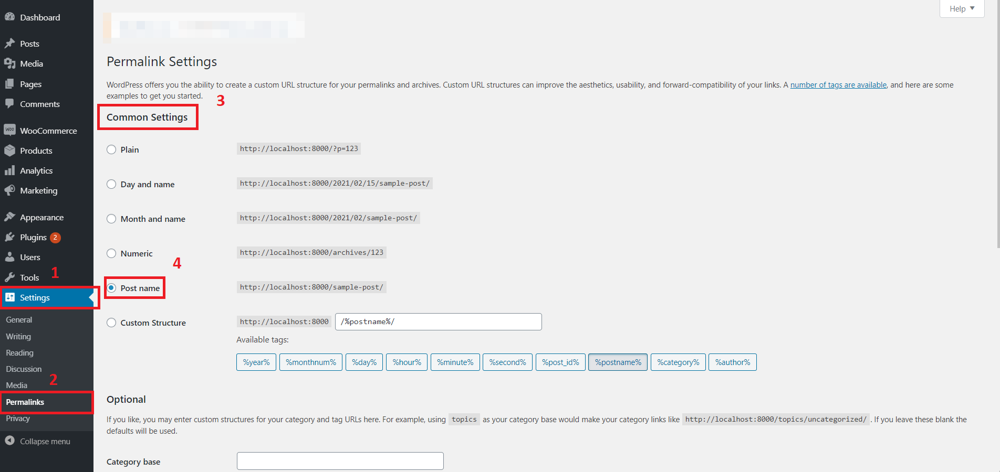
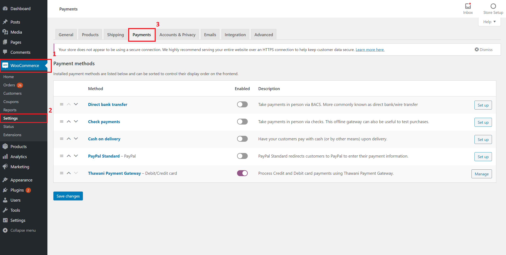
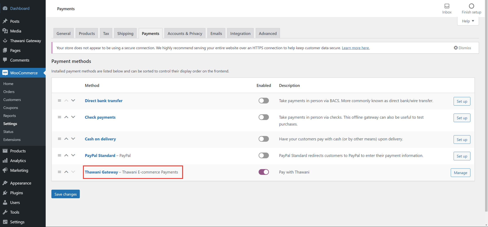
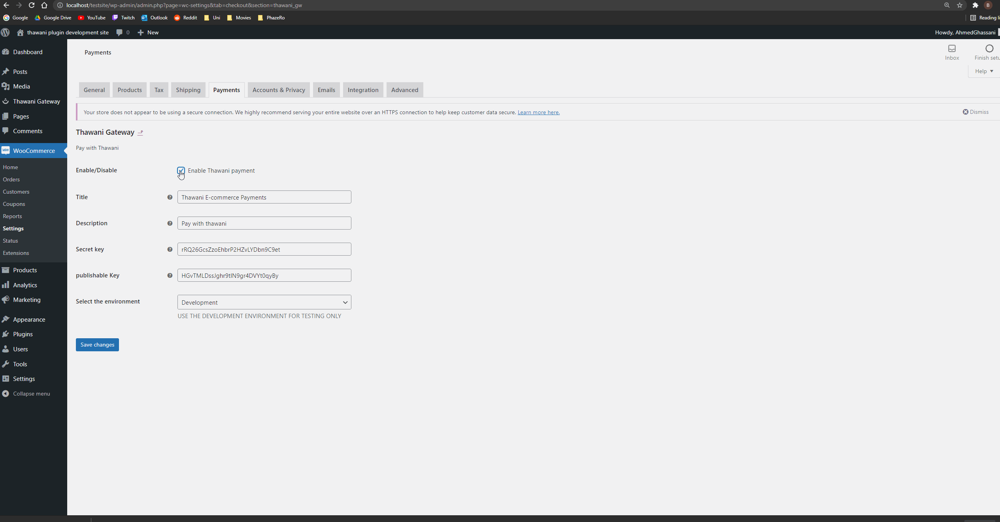
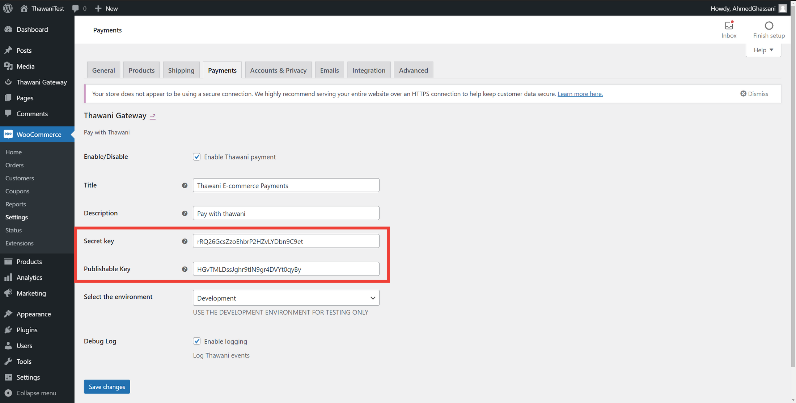
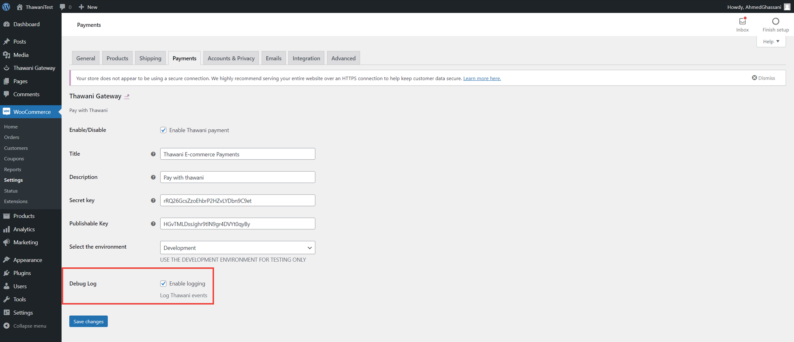
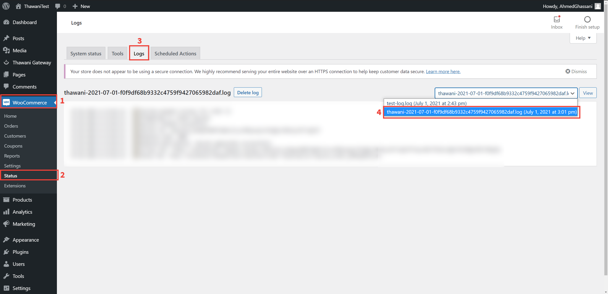

 

  

  <h1 align="center">ThawaniPay C</h1>

  

<!-- Enables Credit/Debit card payments through Thawani on your WooCommerce shop. -->
    Enables Credit/Debit card payments through ThawaniPay on your WooCommerce shop.
     
     
    <a href="https://github.com/w7shdev/thawanipay-c">Report a bug</a>
  

    - A. upload it in the admin dashboard > plugins > install plugin.

  

  <a href="#">Download latest release</a>

 

## Before install

This is a new version of [Thawani-For-WooCommerce](https://github.com/PhazeRoOman/thawani-for-woocommerce). This version is stripped of the features the original plugin provided.
therefore, this plugin is a newer and it replaces the old one. if you want to use the WordPress block feature then this plugin will works for you.

### **⚠ NOTE**
>
> This is not a stable version of the plugin if you wish to use the stable on I prefer that you go and download from the original
> Repository [Thawani-For-WooCommerce](https://github.com/PhazeRoOman/thawani-for-woocommerce)
>
>  

---

> **⚠ INFORMATION & REQUIREMENTS**
>
> - Thawani For WooCommerce is currently only available in Oman.
> - Only OMR is currently supported.
>      

 

The Thawani Plugin for WooCommerce allows merchants to accept Credit & Debit card transactions.

This plugin will only work with WooCommerce and is built to extend it.

## Contribution

Feel free to fork or send a PR, if there is bug fixes only. New features are not acceptable.

## Features

- Credit & Debit card payment.
- Payments are in OMR no conversion currency needed.
- Easy to switch from sandbox and live environment.
- Checks for payment confirmation.
- Track Session History
- Logging to make debugging easy.

## Requirements

- WooCommerce 5.6+
- WordPress > 6.4

For live account, please create a [merchant account](https://thawani.om/merchants/) with Thawani then follow the instructions on their [documentation](https://developer.thawani.om/).

## Installation

1. **Download** the .zip file from this repository.

2. **Go to: WordPress Admin > Plugins > Add New** to upload the .zip file you downloaded with Choose File.

3. **Activate** the extension. (If you haven't already in the previous step)

More information at: [Managing Plugins](https://wordpress.org/support/article/managing-plugins/).

For the plugin to work properly, please make sure that your permalink settings are set to _post name_. To do that **Go to: Settings > Permalinks > Common Settings** and make sure that _post name_ is selected.

## Thawani For WooCommerce Set up

1. **Go to: WooCommerce > Settings > Payments**.

2. Select **Thawani Gateway**. You are taken to the configuration screen.

3. **Enable/Disable** – Enabled by default. Disable to turn off Thawani Pay.

## Configuration

1. Select the Environment:

- Development Environment

In development environment you will be able to make mock payments to simulate the payment processing flow of a live account.

When you are in development mode you will need to use the User Acceptable Test ("UAT") secret and publishable keys and **not** your own secret and publishable keys. These two keys can be found on the [Thawani documentation](https://developer.thawani.om/).

- Production Environment

Production environment is to be used when the website is live

To setup a live account you need the following:

- An SSL certificate.
- A Thawani merchant account. You can apply by visiting [Thawani's website](https://thawani.om/merchants/).
- Access to the Thawani merchant dashboard. This is where you can get your live secret and publishable keys. Learn more by reading [Thawani's documentation](https://developer.thawani.om/).
- Add the following URL: `https//<YOUR-SITE-URL>/wc-api/thawani-payment-status` to the webhook URL section on the Thawani dashboard. Learn more by reading [Thawani's documentation](https://developer.thawani.om/).
- Set the secret and publishable keys in the payment settings page to the secret and publishable keys provided by Thawani

2. Enable logging

Thawani For WooCommerce comes with a troubleshooting tool. This is in the form of logs. The logs are added each time a user orders an item, even if the payment fails.

To enable logging make sure that the _Enable Logging_ checkbox is checked.

To view the logs **Go to: WooCommerce > Status > Logs**

The logs messages for this plugin follow the following format `thawani-<DATE-OF-ORDER-PLACEMENT>`.

## View Session History

The Thawani Gateway plugin keeps a record of all the sessions created to process payments and displays them for the admin.

The plugin keeps a record of:

- Timestamp of when the session was created
- Client refrence / Order ID
- Customer Information
- Payment Status
- Total Amount

Note that this plugin automatically updates the order status as follows:

- **Processing:** Payment received (paid); order is awaiting fulfillment from merchant.
- **On hold:** Awaiting payment
- **Failed:** Payment failed or was declined (unpaid)
- **Canceled:** Canceled by an admin or the customer

For more information about WooCommerce Orders, Go to: [Managing Orders](https://docs.woocommerce.com/document/managing-orders/).

## Frequently Asked Questions

- Q. How can I use this plugin?
    - A. upload it in the admin dashboard > plugins > install plugin.

## License

Distributed under the MIT License. See [License](./LICENSE.md) for more information.
